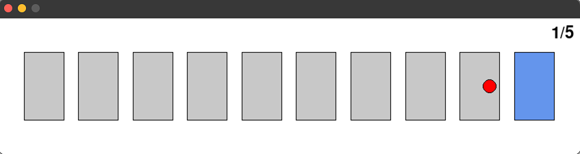
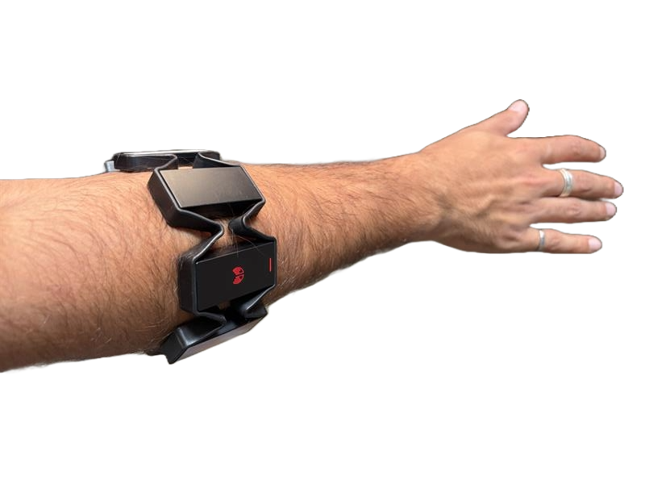

# Continuous Cross User Model 

## Training Offline Model
To train the offline model run `train_model.py`. Make sure you have the latest version of LibEMG installed which has access to the built in datasets. 

## Running Online Model 
Make sure that the Myo Armband LED is on the extensor muscle with the USB port facing downward. Start by running `run_continuous.py`. After feeling the armband buzz, in a seperate terminal run `oned_test.py` to start the GUI. The two will communciate via UDP over localhost. To control the cursor use the wrist flexion (move left) and extension (move right) gestures.

## Armband Orientataion
Make sure the LED is on the extensor muscle and the USB port is facing down. 

